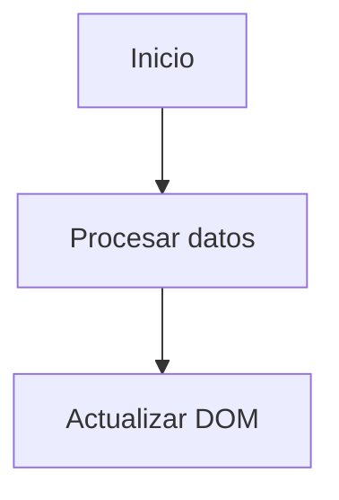

# Project Context
Plataforma de documentación educativa interactiva y codelabs para **"Juan Vladimir | Trainer"** (`juanvladimir13notes.website`).
El sitio aloja material de estudio, avances de contenidos, codelabs paso a paso y modelos de examen para estudiantes de informática y desarrollo web.

---

## 🚀 Stack Tecnológico y Dependencias
- **Framework Principal**: [Astro 6](https://astro.build/) (`astro: ^6.3.7`)
- **Integración de Documentación**: [@astrojs/starlight](https://starlight.astro.build/) (`^0.39.2`)
- **Gestor de Paquetes**: **Bun** (`bun.lock`). *REGLA OBLIGATORIA*: Usar SIEMPRE `bun` (`bun install <paquete>`, `bun run dev`, `bun run build`). NUNCA generar `package-lock.json` ni `yarn.lock`.
- **Cargador de Contenido**: Content Collections de Astro (`src/content.config.ts` con `docsLoader()` y `docsSchema()`).
- **Resaltado de Código**: Expressive Code integrado en Starlight con `@expressive-code/plugin-line-numbers` y temas `['tokyo-night', 'one-light']`.
- **Diagramas**: `astro-mermaid` (`^2.1.0`) basado en Mermaid.js.
- **Procesamiento de Imágenes**: `sharp` (`^0.34.5`).
- **Despliegue**: Firebase Hosting (`firebase.json`, `.firebaserc`).

---

## 📂 Estructura del Proyecto y Contenido
Todo el contenido de documentación reside en `src/content/docs/` en 4 áreas temáticas:

1. **`programacion/`**:
   - `material/`: Guías conceptuales (Estructura y creación de archivos/carpetas, Lenguaje TypeScript).
   - `codelabs/`: Prácticas interactivas (`contador-likes/`, `funciones/`, `array/`).
   - `examen/`: Modelos de examen prácticos y teóricos.
2. **`webdesign/`**:
   - `material/`: Lenguaje PHP, Propiedades CSS.
   - `codelabs/`: Maquetación HTML/CSS, Flexbox CSS.
   - `examen/`: Evaluaciones de CSS, HTML y PHP.
3. **`database/`**:
   - `material/`: Comandos de sesión interactiva, Creación de tablas y registro de datos.
   - `codelabs/`: `ddl-dml` con SQLite.
4. **`tools/`**:
   - `git/`: Instalación, flujo de trabajo y conexión con repositorios remotos.
   - `opencode/`: Instalación y comandos esenciales.

---

## 📝 Convenciones para Contenido Markdown y MDX

### 1. Formato y Extensiones
- Usar extensión `.md` para páginas estáticas de documentación estándar.
- Usar extensión `.mdx` cuando se requieran importar y usar componentes Astro (como `<Keycap />`).

### 2. Frontmatter Obligatorio
Todos los archivos deben incluir `title`, `description` y el bloque `head:` con metadatos OpenGraph y Twitter Card para mantener la identidad visual del sitio:

```yaml
---
title: '1. Título Descriptivo'
description: 'Breve resumen del contenido o codelab'

head:
  - tag: meta
    attrs:
      property: og:title
      content: '1. Título Descriptivo'
  - tag: meta
    attrs:
      property: og:description
      content: 'Breve resumen del contenido o codelab'
  - tag: meta
    attrs:
      property: og:image
      content: 'https://juanvladimir13codelabs.web.app/og-programming.jpg'
  - tag: meta
    attrs:
      property: og:image:width
      content: '1200'
  - tag: meta
    attrs:
      property: og:image:height
      content: '630'
  - tag: meta
    attrs:
      property: og:locale
      content: 'es_BO'
  - tag: meta
    attrs:
      property: og:type
      content: 'article'
  - tag: meta
    attrs:
      property: twitter:card
      content: 'summary_large_image'
  - tag: meta
    attrs:
      property: twitter:title
      content: '1. Título Descriptivo'
  - tag: meta
    attrs:
      property: twitter:description
      content: 'Breve resumen del contenido o codelab'
  - tag: meta
    attrs:
      property: twitter:image
      content: 'https://juanvladimir13codelabs.web.app/og-programming.jpg'
---
```

### 3. Componente Keycap
El componente `Keycap.astro` (`src/components/Keycap.astro`) se utiliza para mostrar atajos de teclado y teclas especiales en tutoriales:
```mdx
import Keycap from '../../../../../components/Keycap.astro';

Presionar la tecla <Keycap text="windowName" /> o la combinación <Keycap text="ctrl" /> + <Keycap text="shiftName" /> + <Keycap text="i" />
```
*Símbolos disponibles*: `shift`, `shiftName`, `ctrl`, `alt`, `altGr`, `enter`, `enterName`, `enterNameEs`, `backspace`, `backspaceName`, `tab`, `tabName`, `bloqMayus`, `up`, `down`, `left`, `right`, `window`, `windowName`, `inicioName`.

### 4. Expressive Code y Bloques de Código
- Añadir títulos descriptivos con el nombre del archivo: ` ```html title="index.html" showLineNumbers `
- Opciones frecuentes: `showLineNumbers`, `wrap`, diffs con `del="..."` e `ins="..."`.

### 5. Admonitions de Starlight
Utilizar bloques de alerta semánticos según el contexto:
- `:::note`: Notas conceptuales y definiciones.
- `:::tip`: Consejos prácticos, buenas prácticas y atajos.
- `:::caution`: Advertencias, ejemplos de errores comunes o entradas/salidas de prueba.
- `:::danger`: Advertencias críticas (ej. borrado de código o errores de tipeo que rompen el script).

### 6. Diagramas Mermaid
Utilizar bloques con identificador `mermaid`:


---

## 🛠️ Estándares para el Diseño de Codelabs
1. **Numeración Secuencial**: Organizar los archivos con prefijo numérico (`0-objetivos.md`, `1-entorno...`, `2-...`).
2. **Estructura Pedagógica**:
   - `0-objetivos.md`: Resumen, ¿Qué aprenderás? y lista de Etapas numeradas.
   - Paso 1: Entorno de desarrollo (`mkdir`, `cd`, `touch`, `code .`).
   - Paso 2: Estructura HTML y enlace de scripts.
   - Pasos 3-4: Lógica JavaScript, manipulación del DOM y funciones con listeners.
   - Pasos de Verificación: Instrucciones claras para validar en Google Chrome, consola (`Ctrl + Shift + I`) y soluciones a typos/bugs.
   - Retos finales: Ejercicios complementarios para afianzar el aprendizaje.

---

## 🧭 Configuración del Sidebar (`src/config/sidebar.ts`)
- La barra lateral se organiza por secciones (`Programación`, `Web design`, `Base de datos`, `Herramientas`).
- Para los directorios de codelabs y exámenes, se utiliza `autogenerate` (ej. `{ autogenerate: { directory: 'programacion/codelabs/array' } }`).
- Mantener los enlaces actualizados en caso de añadir nuevas categorías principales.

---

## 🌐 Idioma y Convenciones Generales
- El idioma principal para toda la documentación, mensajes de interfaz y commits es el **español**.
- Al modificar `astro.config.mjs`, pasar temas y propiedades como cadenas primitivas para evitar errores con objetos congelados en Expressive Code.
