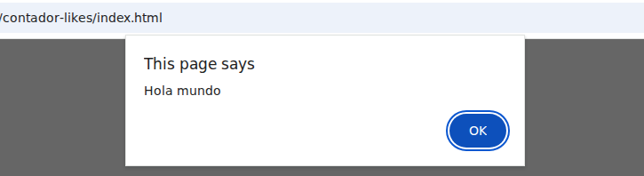

import Keycap from "../../../../../components/Keycap.astro";

```html title="index.html" showLineNumbers
<html lang="es">
  <head>
    <meta charset="UTF-8">
    <title>Tecnico medio</title>
  </head>
  <body>
    <header></header>
    <main>
      <h1>Contador de likes</h1>
    </main>
    <footer></footer>
  </body>
</html>
```

### Incluir archivos scripts en HTML
Agregar el archivo `counter.js` al archivo `index.html`, incluir el siguiente contenido antes de la etiqueta `</body>`

```html title="index.html" 
<script src="counter.js"></script>
```

## Funciones de javascript/typescript

```js title="counter.js"
alert("Hola mundo");
```

### Verificar avance
Abrir el archivo `index.html` en el navegador **google chrome**

#### Resultado correcto 😎



#### Resultado incorrecto ☹️
- Presionar la combinacion de teclas <Keycap text="ctrl" /> + <Keycap text="shiftName" /> + <Keycap text="i" />
- Seleccionar el menu `Console`
- Leer los mensajes de error y solucionar el **bug** o **typo**


:::note
**Bug** es un programa que no hace lo que se espera que haga

**Typo** es un error de tipeo (escritura del codigo)
:::
