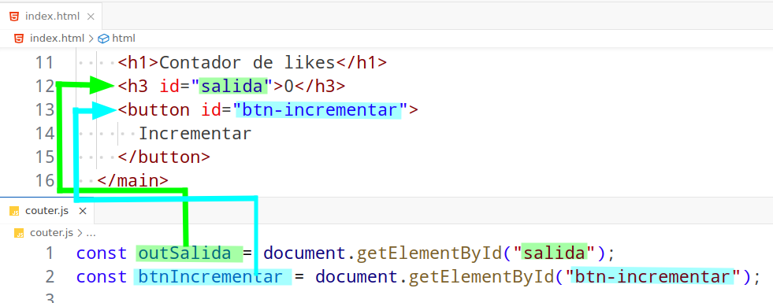
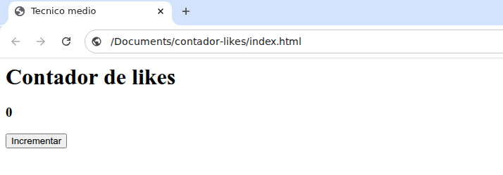
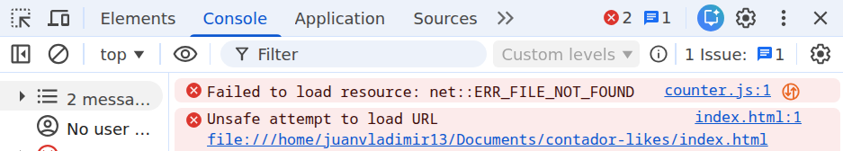

import Keycap from "../../../../../components/Keycap.astro";

## Implementar la lógica del contador

- Declarar una variable global
- Obtener referencias de las etiquetas **HTML** en **JavaScript**
- Agregar un **listener** para ejecutar la funcion del contador

### Declarar una variable global para el contador

```js title="counter.js"
let contador = 0;
```

### Obtener referencias de las etiquetas HTML

```js title="counter.js"
const outSalida = document.getElementById("salida");
const btnIncrementar = document.getElementById("btn-incrementar");
```
#### Acceso de javascript a elementos HTML


:::danger
Verificar que los valores de los atributos `id` de las etiquetas **HTML** esten **escritos correctamente en `javascript`**, _si no coinciden no se podra acceder a las etiquetas_
:::

### Agregar un listener a una etiqueta HTML

**Estructura de un listener**
```js del="click" "(evt) => { }" ins="btnIncrementar"
btnIncrementar.addEventListener("click", (evt) => { } );
```

- **btnIncrementar** : Etiqueta HTML a la que se le va a _agregar el listener_
- **click** : Indica el tipo de _evento a escuchar_
- **(evt) => \{  \}** : Funcion a ejecutar cuando se detecta el _evento_

**Agregar el listener a la etiqueta HTML**

```js title="counter.js" showLineNumbers
btnIncrementar.addEventListener("click", (evt) => {
  contador = contador + 1;
  outSalida.textContent = String(contador);
});
```

- **contador = contador + 1** : Incrementa el valor de la variable `contador` en 1
- **String(contador)** : Convierte el valor de la variable `contador` a String
- **outSalida.textContent** : Muestra el valor de la variable `contador` en la etiqueta HTML con el atributo `id` igual a `salida`

### Verficar el avance
1. Abrir o recargar el archivo `index.html` en **google chrome**
2. Presionar la combinacion de teclas <Keycap text="ctrl" /> + <Keycap text="shiftName" /> + <Keycap text="i" />
3. Seleccionar el menu `Console`
#### Resultado correcto 😎
Al presionar el boton **`Incrementar`** debe incrementar el valor del **contador**




#### Resultado incorrecto ☹️
Leer los mensajes de error y solucionar el **bug** o **typo**


