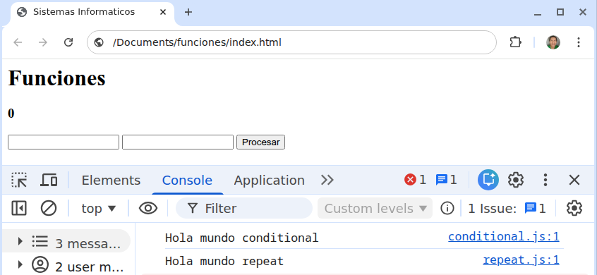

import Keycap from "../../../../../components/Keycap.astro";

## Diseño de formulario HTML

```html title="index.html" showLineNumbers
<html lang="es">
  <head>
    <meta charset="UTF-8">
    <title>SIS INF</title>
  </head>
  <body>
    <header></header>
    <main>
      <h1>Funciones</h1>
    </main>
    <footer></footer>
  </body>
</html>
```

### Etiqueta para mostrar datos
Debajo de la etiqueta `h1` agregar una etiqueta `h3` para mostrar datos, con un **atributo** `id` con el **valor** de `out-salida`

```html title="index.html"
<h3 id="out-salida">0</h3>
```

### Etiqueta para insertar datos

Debajo de la etiqueta `h3` agregar una etiqueta `input` con un **atributo** `id` con el **valor** de `inp-one`

```html title="index.html"
<input type="text" name="number-one" id="inp-one">
```

Debajo de la etiqueta `input` agregar una etiqueta `input` con un **atributo** `id` con el **valor** de `inp-two`

```html title="index.html"
<input type="text" name="number-two" id="inp-two">
```

### Etiqueta para procesar datos

Agregar una etiqueta `button` con un **atributo** `id` con el **valor** de `btn-process`

```html title="index.html"
<button id="btn-process">
  Procesar
</button>
```

### Incluir archivos scripts en HTML
Agregar el archivo `conditional.js` y `repeat.js` antes de la etiqueta `</body>` en el archivo `index.html`

```html title="index.html" wrap
  <script src="conditional.js"></script>
  <script src="repeat.js"></script>
```

## Funciones de javascript

```js title="conditional.js"
console.log("Hola mundo conditional");
```

```js title="repeat.js"
console.log("Hola mundo repeat");
```

### Verificar avance

1. Abrir el archivo `index.html` en **google chrome**
2. Presionar la combinacion de teclas <Keycap text="ctrl" /> + <Keycap text="shiftName" /> + <Keycap text="i" />
3. Seleccionar el menu `Console`

#### Resultado correcto 😎


#### Resultado incorrecto ☹️

:::danger
Leer los mensajes de error y solucionar el **bug** o **typo**
:::
