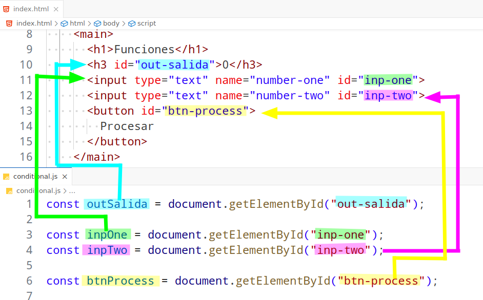
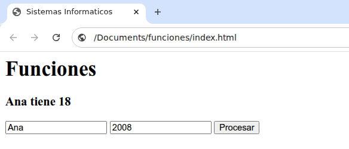

import Keycap from '@components/Keycap.astro';

Agregar los siguientes contenidos en el archivo `conditional.js`

### Variables globales
```js title="conditional.js"
let parametroOne = "";
let parametroTwo = "";
```

### Obtener referencias a las etiquetas HTML
```js title="conditional.js" showLineNumbers
const outSalida = document.getElementById("out-salida");

const inpOne = document.getElementById("inp-one");
const inpTwo = document.getElementById("inp-two");

const btnProcess = document.getElementById("btn-process");
```

#### Acceso de javascript a elementos HTML


:::danger
Verificar que los valores de los atributos `id` de las etiquetas **HTML** esten **escritos correctamente en `javascript`**, _si no coinciden no se podra acceder a las etiquetas_
:::

### Crear una funcion para procesar datos
```js title="conditional.js"
function calcularEdad(anioNacimiento){
    return 2026 - anioNacimiento;
}
```

### Estructura de un listener
```js del="click" "(evt) => { }" ins="btnProcess"
btnProcess.addEventListener("click", (evt) => { } );
```
- **btnProcess** : Etiqueta HTML a la que se le va a agregar el listener
- **click** : Indica el tipo de evento a escuchar
- **(evt) => \{  \}** : Funcion a ejecutar cuando se detecta el evento

### Agregar un listener a una etiqueta
```js title="conditional.js" showLineNumbers
btnProcess.addEventListener("click", (evt) => {
  parametroOne = String(inpOne.value);
  parametroTwo = Number(inpTwo.value);
  const edad = calcularEdad(parametroTwo);
  outSalida.textContent = parametroOne + " tiene " + String(edad);
});
```

- **inpOne.value** : Obtiene el valor de la etiqueta input con el atributo `id` igual a `inp-one`
- **String(inpOne.value)** : Convierte el valor de **inpOne.value** a String
- **inpTwo.value** : Obtiene el valor de la etiqueta input con el atributo `id` igual a `inp-two`
- **Number(inpTwo.value)** : Convierte el valor de **inpTwo.value** a numero
- **calcularEdad(parametroTwo)** : Llama a la funcion `calcularEdad` con el valor del parametro `parametroTwo`
- **String(edad)** : Convierte el valor de **edad** a String
- **outSalida.textContent** : Muestra el resultado del texto concatenado en la etiqueta `outSalida` con el atributo `id` igual a `out-salida`

### Verificar avance
1. Abrir/recargar el archivo `index.html` en **google chrome**
2. Presionar la combinacion de teclas <Keycap text="ctrl" /> + <Keycap text="shiftName" /> + <Keycap text="i" />
3. Seleccionar el menu `Console`
4. Al presionar el boton **Procesar** debe mostrar el valor calculado

#### Resultado correcto 😎


#### Resultado incorrecto ☹️
Leer los mensajes de error y solucionar el **bug** o **typo**
