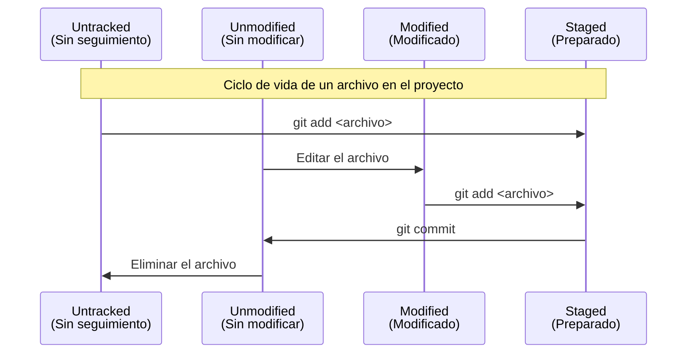
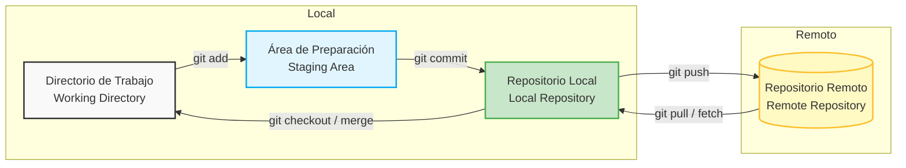

### Estados de los Archivos (Ciclo de vida)

Además de conocer las áreas de trabajo, es importante entender los **estados** en los que puede estar un archivo durante el desarrollo de tu proyecto. El siguiente diagrama de secuencia detalla cómo cambian los estados mediante los comandos de Git:



Para utilizar Git eficazmente, es crucial entender cómo gestiona **los estados de los archivos**. Git tiene tres áreas principales donde los archivos pueden residir localmente, más un entorno remoto:

**Directorio de Trabajo (Working Directory):** Es el directorio local donde estás modificando tus archivos actualmente. Aquí es donde agregas, editas o eliminas código.

**Área de Preparación (Staging Area):** Es un área intermedia donde "agrupas" y preparas los cambios que formarán parte de tu próximo *commit*.

**Repositorio Local (Local Repository):** Es la base de datos local de Git (la carpeta `.git`). Una vez que haces un *commit*, los cambios se guardan aquí de manera permanente como un nuevo punto en la historia.

**Repositorio Remoto (Remote Repository):** Es el servidor (como GitHub, GitLab o Bitbucket) donde compartes tu código con el resto del equipo.

### Representación Gráfica

El siguiente diagrama ilustra cómo interactúan estas áreas y qué comandos se utilizan para mover los archivos entre ellas:



### Comandos Clave del Flujo

#### `git status`
Revisa el estado actual de los archivos (cuáles están modificados, cuáles están en el área de preparación, etc.).

Verifica en qué estado están los archivos
```bash
git status
```
Salida de ejemplo:
```bash
On branch main
Changes not staged for commit:
  modified:   index.html
```

#### `git add`
Mueve un archivo modificado desde el Directorio de Trabajo al Área de Preparación.

Agregar un archivo específico
```bash
git add index.html
```

Agregar todos los archivos modificados o nuevos
```bash
git add .
```

#### `git commit`
Toma los archivos del Área de Preparación y los guarda definitivamente en el Repositorio Local.

Guardar los cambios con un mensaje descriptivo
```bash
git commit -m "Añadir estructura inicial de la página de inicio"
```

#### `git push`
Envía los *commits* locales al Repositorio Remoto.

Subir los cambios a la rama principal (main) del repositorio remoto (origin)
```bash
git push origin main
```

#### `git pull`
Trae los cambios del Repositorio Remoto y los fusiona en tu Directorio de Trabajo actual.

Actualizar tu entorno local con los últimos cambios de la nube
```bash
git pull origin main
```
