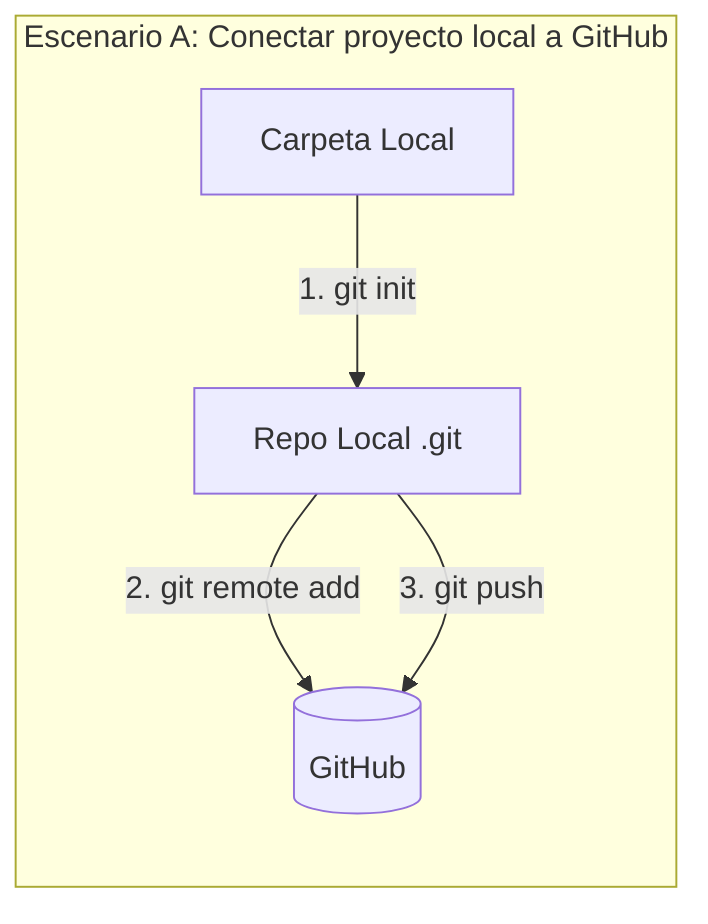
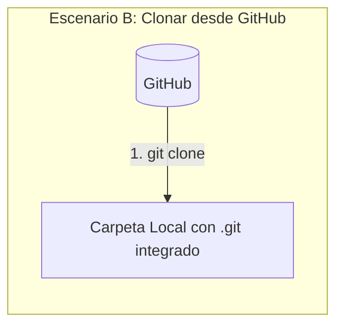

Una de las tareas más comunes es tener un proyecto ya empezado localmente en tu computadora y querer subirlo a GitHub.

## Crear el repositorio en GitHub

1. Inicia sesión en [GitHub](https://github.com/).
2. Haz clic en el botón verde **"New"** (Nuevo).
3. Asigna un **Nombre** al repositorio (preferiblemente el mismo nombre de la carpeta de tu proyecto local).
4. Selecciona la visibilidad: **Público** (cualquiera puede verlo) o **Privado** (solo tú y tus colaboradores).
5. **¡Importante!** Dado que ya tienes código localmente, **NO** marques las casillas para agregar un archivo `README`, un `.gitignore` o una licencia. Si las marcas, GitHub creará un *commit* inicial que generará conflictos con tu historial local.
6. Haz clic en **"Create repository"**.

## Conectar tu proyecto local al repositorio
GitHub te mostrará una pantalla con instrucciones. Abre tu terminal, asegúrate de estar dentro de la carpeta de tu proyecto local, y ejecuta:

### `git init`
Inicializar el repositorio local (omite este paso si ya usabas git en tu carpeta)
```bash
git init
```

### `git branch`
Asegurar que tu rama principal se llame 'main'
```bash
git branch -M main
```

### `git add .`
Agregar todos los archivos al area de preparacion
```bash
git add .
```

### `git commit`
Crear el primer commit local
```bash
git commit -m "commit inicial"
```

Vincular tu repositorio local con el repositorio remoto de GitHub
### `git remote`
```
git remote add origin https://github.com/TU_USUARIO/NOMBRE_DEL_REPO.git
```

### `git push`
Subir el código a GitHub
```bash
git push -u origin main
```

> **Nota:** Solo necesitas usar `-u` (o `--set-upstream`) la primera vez que subes una rama. Esto vincula tu rama local con la rama remota. Para futuros *commits* en esa rama, solo tendrás que ejecutar `git push`.

## Clonar un Repositorio de GitHub

Si el proyecto ya existe en GitHub (porque lo creó otra persona, o lo creaste tú en la web), el proceso es mucho más rápido. "Clonar" significa descargar una copia exacta de todo el repositorio (archivos y el historial de *commits* de `.git`) a tu computadora local.


### Pasos para Clonar

1. Ve a la página principal del repositorio en [GitHub](https://github.com/).
2. Haz clic en el botón verde **"<> Code"**.
3. Asegúrate de estar en la pestaña **HTTPS** y copia la URL proporcionada (por ejemplo, `https://github.com/usuario/nombre-del-repo.git`).
4. Abre tu terminal y navega hasta la carpeta raíz donde deseas que se guarde el proyecto (por ejemplo, `Documentos/Proyectos`).
5. Ejecuta el comando `git clone` seguido de la URL que copiaste:

```bash
git clone https://github.com/TU_USUARIO/NOMBRE_DEL_REPO.git
```

### Siguiente Paso Crucial

El comando `git clone` creará automáticamente una nueva carpeta con el nombre del repositorio. **Debes entrar a esa carpeta** antes de ejecutar cualquier otro comando de Git o empezar a programar:

```bash
cd NOMBRE_DEL_REPO
```

A partir de este momento, ya estás vinculado al remoto. Si haces cambios, solo necesitarás hacer `git add`, `git commit`, y finalmente `git push` (sin necesidad del flag `-u` ni de agregar el origen, ya que Git lo configuró todo automáticamente al clonar).
