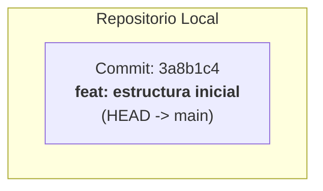
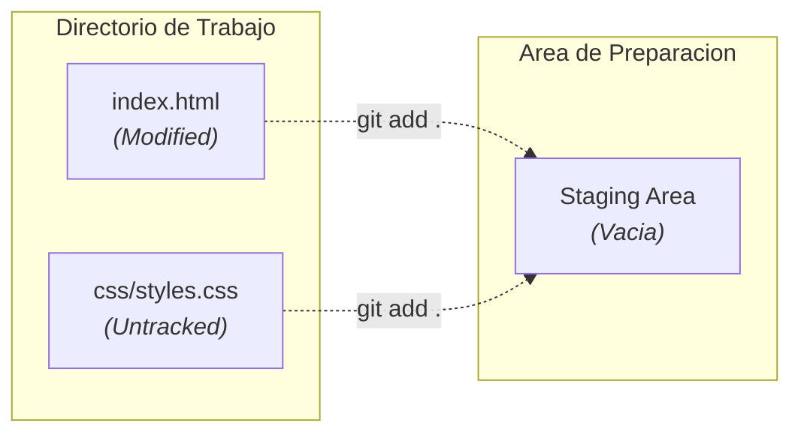
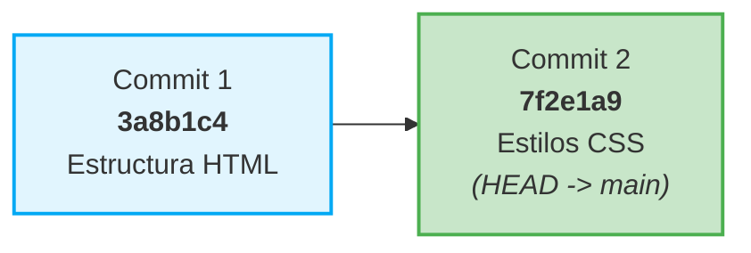

Comprender la teoría de Git es solo el primer paso. Para dominarlo verdaderamente, debemos observar cómo acompaña el día a día en el desarrollo de un proyecto web.

En este ejemplo práctico simularemos la creación de una página web personal paso a paso. Verás qué ocurre en cada una de las áreas de Git a medida que creas archivos HTML, añades hojas de estilo CSS y corriges errores.

---

## El Ciclo de Vida en un Proyecto Web

Durante el desarrollo web, tu flujo de trabajo sigue una secuencia estructurada que comienza con la inicialización, pasa por el ciclo iterativo de desarrollo y culmina con la consulta del historial y la sincronización:

```mermaid
flowchart LR
    Init["0. Inicializar<br/>(git init)"] --> Code["1. Escribir Código<br/>(HTML / CSS)"]
    Code --> Status["2. Inspeccionar<br/>(git status / diff)"]
    Status --> Add["3. Preparar<br/>(git add)"]
    Add --> Commit["4. Guardar Versión<br/>(git commit)"]
    Commit --> Log["5. Revisar Historial<br/>(git log)"]
    Log --> Push["6. Sincronizar Nube<br/>(git push)"]
    Push -. "Nueva funcionalidad" .-> Code

    style Init fill:#ede7f6,stroke:#512da8,stroke-width:2px
    style Code fill:#e3f2fd,stroke:#1976d2,stroke-width:2px
    style Status fill:#fff3e0,stroke:#f57c00,stroke-width:2px
    style Add fill:#e8f5e9,stroke:#388e3c,stroke-width:2px
    style Commit fill:#f3e5f5,stroke:#7b1fa2,stroke-width:2px
    style Log fill:#e0f7fa,stroke:#00838f,stroke-width:2px
    style Push fill:#fce4ec,stroke:#c2185b,stroke-width:2px
```



---

## Paso 1: Iniciar el Proyecto Web

Abrimos la terminal y creamos el directorio de trabajo donde vivirá nuestro sitio web.

```bash title="Terminal" showLineNumbers
mkdir mi-portafolio
cd mi-portafolio
git init
```

Al ejecutar `git init`, Git crea una carpeta oculta llamada `.git`. A partir de este momento, todo lo que ocurra dentro de `mi-portafolio` puede ser rastreado.

### Crear la estructura HTML inicial

Creamos el archivo principal `index.html`:

```html title="index.html" showLineNumbers
<!DOCTYPE html>
<html lang="es">
<head>
  <meta charset="UTF-8">
  <meta name="viewport" content="width=device-width, initial-scale=1.0">
  <title>Mi Portafolio Web</title>
</head>
<body>
  <header>
    <h1>Hola, soy Desarrollador Web</h1>
    <p>Bienvenido a mi sitio web personal.</p>
  </header>
</body>
</html>
```

### ¿Qué opina Git en este momento?

Consultamos el estado actual del proyecto:

```bash title="Terminal" showLineNumbers
git status
```

Salida esperada en la consola:

```bash title="Salida de Terminal"
On branch main

No commits yet

Untracked files:
  (use "git add <file>..." to include in what will be committed)
	index.html

nothing added to commit but untracked files present (use "git add" to track)
```

:::note
El archivo aparece en color **rojo** bajo la categoría **Untracked** (sin seguimiento). Git sabe que el archivo existe en tu disco, pero todavía no tiene la orden de registrar su historial.
:::

---

## Paso 2: La Primera Fotografía (Commit Inicial)

Para que Git guarde una versión de nuestro archivo, primero debemos moverlo al **Área de Preparación** (*Staging Area*) y luego tomar la "fotografía" (*Commit*).

### 1. Pasar a Staging

```bash title="Terminal" showLineNumbers
git add index.html
```

Verificamos el cambio de estado:

```bash title="Terminal" showLineNumbers
git status
```

```bash title="Salida de Terminal"
On branch main

No commits yet

Changes to be committed:
  (use "git rm --cached <file>..." to unstage)
	new file:   index.html
```

Ahora `index.html` aparece en color **verde**. Está listo para ser inmortalizado.

### 2. Confirmar el Commit

```bash title="Terminal" showLineNumbers
git commit -m "feat: estructura inicial de la pagina web"
```

```bash title="Salida de Terminal"
[main (root-commit) 3a8b1c4] feat: estructura inicial de la pagina web
 1 file changed, 13 insertions(+)
 create mode 100644 index.html
```



¡Felicidades! Tienes tu primer punto de guardado en la historia del proyecto.

---

## Paso 3: Agregar Estilos y Detectar Estados Simultáneos

Un proyecto web real consta de múltiples archivos. Ahora añadiremos una carpeta con estilos CSS y vincularemos la hoja a nuestro archivo HTML.

Creamos la carpeta `css` y el archivo `css/styles.css`:

```css title="css/styles.css" showLineNumbers
body {
  font-family: Arial, sans-serif;
  background-color: #f4f6f8;
  color: #333;
  margin: 0;
  padding: 2rem;
}

header {
  background: #ffffff;
  padding: 2rem;
  border-radius: 8px;
  box-shadow: 0 2px 4px rgba(0, 0, 0, 0.1);
}
```

Ahora modificamos `index.html` para incluir el enlace al CSS:

```html title="index.html" showLineNumbers ins={7}
<!DOCTYPE html>
<html lang="es">
<head>
  <meta charset="UTF-8">
  <meta name="viewport" content="width=device-width, initial-scale=1.0">
  <title>Mi Portafolio Web</title>
  <link rel="stylesheet" href="css/styles.css">
</head>
<body>
  <header>
    <h1>Hola, soy Desarrollador Web</h1>
    <p>Bienvenido a mi sitio web personal.</p>
  </header>
</body>
</html>
```

### La dualidad de estados en Git

Ejecuta `git status` y observa con atención:

```bash title="Terminal" showLineNumbers
git status
```

```bash title="Salida de Terminal"
On branch main
Changes not staged for commit:
  (use "git add <file>..." to update what will be committed)
  (use "git restore <file>..." to discard changes in working directory)
	modified:   index.html

Untracked files:
  (use "git add <file>..." to include in what will be committed)
	css/

no changes added to commit (use "git add" to track)
```

Observa la diferencia fundamental:
- **`index.html` está en estado `modified` (modificado)**: Git ya lo conocía en el commit anterior y detectó que su contenido ha cambiado.
- **`css/` está en estado `untracked` (sin seguimiento)**: Es una carpeta y archivo totalmente nuevos para Git.



### Inspeccionar los cambios exactos con `git diff`

Antes de preparar los archivos, podemos revisar exactamente qué líneas cambiaron en `index.html`:

```bash title="Terminal" showLineNumbers
git diff index.html
```

```diff title="Salida de git diff"
diff --git a/index.html b/index.html
index b8e1c12..59f9a01 100644
--- a/index.html
+++ b/index.html
@@ -4,6 +4,7 @@
   <meta charset="UTF-8">
   <meta name="viewport" content="width=device-width, initial-scale=1.0">
   <title>Mi Portafolio Web</title>
+  <link rel="stylesheet" href="css/styles.css">
 </head>
 <body>
```

Git nos indica con un símbolo `+` verde la línea exacta que acabamos de agregar.

### Guardar la segunda versión

Preparamos todos los cambios a la vez y confirmamos el segundo commit:

```bash title="Terminal" showLineNumbers
git add .
git commit -m "style: agregar hoja de estilos CSS y vincularla a index.html"
```

---

## Paso 4: La Máquina del Tiempo (Deshacer Errores)

Uno de los mayores beneficios de usar Git en desarrollo web es la seguridad contra accidentes.

Imagina que estabas experimentando con el diseño y accidentalmente rompiste los estilos en `css/styles.css`:

```css title="css/styles.css" showLineNumbers
/* Error accidental: fondo rojo chillón y texto oculto */
body {
  background-color: #ff0000;
  display: none;
}
```

Al abrir tu navegador, el sitio desapareció por completo. ¡No entres en pánico!

### 1. Verificar qué se alteró
```bash title="Terminal" showLineNumbers
git status
```
Git te indicará que `css/styles.css` ha sido modificado.

### 2. Descartar los cambios y restaurar el archivo sano
```bash title="Terminal" showLineNumbers
git restore css/styles.css
```

Al instante, Git sobreescribe el archivo con la última versión guardada en el commit anterior. Tu archivo vuelve a estar 100% funcional.

:::tip
`git restore <archivo>` te permite experimentar libremente en tu código web. Si algo no sale bien, puedes volver al último estado funcional en un solo segundo.
:::

---

## Paso 5: Consultar la Línea de Tiempo del Proyecto

Para ver la biografía completa del sitio web, usamos el comando `git log`:

```bash title="Terminal" showLineNumbers
git log --oneline --graph
```

```bash title="Historial del Proyecto"
* 7f2e1a9 (HEAD -> main) style: agregar hoja de estilos CSS y vincularla a index.html
* 3a8b1c4 feat: estructura inicial de la pagina web
```



Cada *commit* es un escalón sólido. Puedes viajar en el tiempo a cualquiera de ellos, comparar versiones o crear ramas alternativas para nuevas funciones.

---

## Paso 6: Ignorar Archivos con `.gitignore`

En proyectos web reales, existen archivos y carpetas que **nunca** deben subirse a Git ni compartirse públicamente:
- Carpetas de dependencias pesadas (como `node_modules/`).
- Archivos de configuración local del editor (como `.vscode/`).
- Variables de entorno o claves secretas (como `.env`).
- Archivos temporales del sistema operativo (como `.DS_Store` o `Thumbs.db`).

Para excluir estos elementos, creamos un archivo en la raíz del proyecto llamado `.gitignore`:

```bash title=".gitignore" showLineNumbers
# Dependencias de paquetes
node_modules/

# Variables de entorno y secretos
.env
.env.local

# Configuración del editor
.vscode/
.idea/

# Archivos del sistema
.DS_Store
Thumbs.db
```

Guardamos y añadimos el `.gitignore` a nuestro repositorio:

```bash title="Terminal" showLineNumbers
git add .gitignore
git commit -m "chore: configurar reglas de archivos ignorados en gitignore"
```

---

## Tabla Resumen: Tu Flujo Diario en Desarrollo Web

| Qué haces en tu proyecto web | Comando Git | Área de destino / Propósito |
| :--- | :--- | :--- |
| Iniciar el control de versiones en la carpeta del proyecto | `git init` | Crea el Repositorio Local (`.git`) |
| Creas o editas `index.html`, `styles.css` o `script.js` | *Guardar en editor (Ctrl+S)* | Directorio de Trabajo |
| Ver qué archivos cambiaron desde la última versión | `git status` | Diagnóstico de estados |
| Ver las líneas exactas agregadas o borradas | `git diff` | Comparación de cambios |
| Seleccionar archivos que formarán la próxima versión | `git add <archivo>` o `git add .` | Staging Area (Preparación) |
| Guardar una foto permanente de esa versión | `git commit -m "mensaje"` | Repositorio Local |
| Consultar la línea de tiempo y versiones confirmadas | `git log --oneline` | Inspección de Historial |
| Descartar un error antes de hacer commit | `git restore <archivo>` | Directorio de Trabajo |
| Subir tus avances a GitHub | `git push origin main` | Repositorio Remoto |

:::tip
**Convención para Mensajes de Commit:** En proyectos web profesionales se recomienda usar prefijos semánticos como:
- `feat:` para una nueva característica (ej. `feat: agregar formulario de contacto`).
- `style:` para cambios visuales o maquetación (ej. `style: ajustar tipografia y espaciado`).
- `fix:` para corregir un error (ej. `fix: corregir enlace roto en la barra de navegacion`).
- `docs:` para documentación (ej. `docs: actualizar instrucciones en README`).
:::
