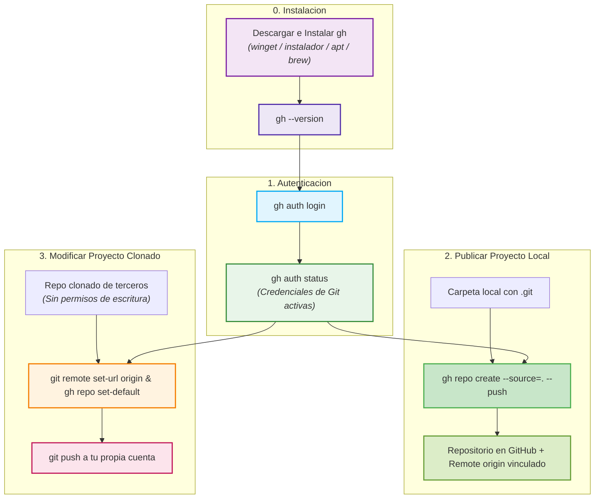

**GitHub CLI (`gh`)** es la herramienta oficial de línea de comandos de GitHub. Permite autenticarte, crear repositorios remotos y gestionar permisos directamente desde la terminal, sin necesidad de salir al navegador para copiar URLs ni configurar tokens manualmente.

---

## Flujo de Trabajo con `gh`



---

## Paso 1: Descargar e Instalar GitHub CLI (`gh`)

Antes de utilizar los comandos de GitHub en la terminal, debes instalar la herramienta oficial en tu sistema operativo:

### En Windows

Puedes elegir cualquiera de las siguientes dos opciones:

#### Opción A: Mediante instalador oficial (.msi)
1. Ingresa a la página oficial de descarga: [cli.github.com](https://cli.github.com/).
2. Haz clic en el botón **Download for Windows** para descargar el instalador `.msi`.
3. Ejecuta el archivo descargado y sigue las instrucciones del asistente (*Next* $\rightarrow$ *Install* $\rightarrow$ *Finish*).

#### Opción B: Mediante la terminal con winget
Abre tu terminal (`PowerShell` o `CMD`) y ejecuta:

```bash title="Terminal" showLineNumbers
winget install --id GitHub.cli
```

### En Linux (Debian / Ubuntu)

Ejecuta en tu terminal:

```bash title="Terminal" showLineNumbers
sudo apt update
sudo apt install gh
```

### En macOS

Si utilizas el gestor de paquetes Homebrew:

```bash title="Terminal" showLineNumbers
brew install gh
```

### Verificar la instalación

Una vez instalado, abre una **nueva ventana** de terminal (`Git Bash`, `PowerShell` o `CMD`) y verifica que `gh` responda correctamente:

```bash title="Terminal" showLineNumbers
gh --version
```

Salida esperada:

```bash title="Salida de Terminal"
gh version 2.x.x (YYYY-MM-DD)
https://github.com/cli/cli/releases/tag/v2.x.x
```

:::tip
Si la terminal indica que `gh` no se reconoce como un comando interno o externo, asegúrate de cerrar la ventana de la terminal y volver a abrirla para que cargue las nuevas variables de entorno del sistema.
:::

---

## Paso 2: Conectar tu Cuenta con `gh auth login`

Para que Git tenga permisos de publicación (`push`) en tus repositorios de GitHub, debes autenticar tu cuenta mediante GitHub CLI.

Ejecuta en tu terminal:

```bash title="Terminal" showLineNumbers
gh auth login
```

El comando iniciará un asistente interactivo con las siguientes preguntas:

1. **What account do you want to log into?**  
   Selecciona: `GitHub.com`

2. **What is your preferred protocol for Git operations?**  
   Selecciona: `HTTPS`

3. **Authenticate Git with your GitHub credentials?**  
   Selecciona: `Yes`  
   *(¡Muy importante! Esto activa el gestor de credenciales para que los comandos `git push` funcionen de inmediato sin pedir contraseña).*

4. **How would you like to authenticate GitHub CLI?**  
   Selecciona: `Login with a web browser`

A continuación, la terminal mostrará un código temporal de 8 caracteres (por ejemplo: `ABCD-1234`):

```bash title="Salida de Terminal"
! First copy your one-time code: ABCD-1234
Press Enter to open github.com in your browser...
```

5. Presiona la tecla <kbd>Enter</kbd> para abrir GitHub en tu navegador predeterminado.
6. Pega el código de un solo uso y haz clic en **Authorize github**.

### Verificar que la sesión está activa

Una vez autorizado en el navegador, regresa a tu terminal y verifica el estado:

```bash title="Terminal" showLineNumbers
gh auth status
```

Salida esperada:

```bash title="Salida de Terminal"
github.com
  ✓ Logged in to github.com account tu-usuario (keyring)
  - Active account: true
  - Git operations protocol: https
  - Token: gho_************************************
  - Token scopes: 'gist', 'read:org', 'repo'
```

:::tip
Al responder **Yes** a la configuración de credenciales de Git, `gh` se encarga de renovar y gestionar tus tokens de forma segura. Ya no necesitarás lidiar con Tokens de Acceso Personal (PAT) manuales.
:::

---

## Paso 3: Crear y Publicar un Repositorio con `gh`

Cuando tienes un proyecto web local (con su carpeta `.git` y al menos un commit inicial) y deseas subirlo por primera vez a GitHub, `gh` puede crear el repositorio en la nube, vincular el remoto y hacer el primer push en un solo comando.

### El comando directo (Recomendado)

Estando dentro de la carpeta de tu proyecto local:

```bash title="Terminal" showLineNumbers
gh repo create mi-proyecto-web --public --source=. --remote=origin --push
```

Desglose de los argumentos:
- `mi-proyecto-web`: Nombre que tendrá el repositorio en tu cuenta de GitHub.
- `--public`: Crea el repositorio con visibilidad pública (usa `--private` si prefieres que sea privado).
- `--source=.`: Utiliza la carpeta local actual como fuente del código.
- `--remote=origin`: Configura automáticamente el nombre del remoto como `origin`.
- `--push`: Sube inmediatamente tu rama principal (`main`) a GitHub.

### Salida esperada en la consola:

```bash title="Salida de Terminal"
✓ Created repository tu-usuario/mi-proyecto-web on GitHub
  https://github.com/tu-usuario/mi-proyecto-web
✓ Added remote https://github.com/tu-usuario/mi-proyecto-web.git
✓ Pushed commits to https://github.com/tu-usuario/mi-proyecto-web.git
```

### Abrir el repositorio en el navegador

Puedes abrir la página web de tu repositorio recién creado directamente desde la terminal con:

```bash title="Terminal" showLineNumbers
gh repo view --web
```

---

## Paso 4: Cambiar el `remote` a un Repositorio Clonado

Un caso muy común en entornos académicos y de trabajo ocurre cuando clonas un repositorio de otra persona (por ejemplo, una plantilla del profesor o un proyecto base de un compañero):

```bash title="Terminal" showLineNumbers
git clone https://github.com/profesor/plantilla-web.git
cd plantilla-web
```

Si realizas cambios en el código e intentas hacer `git push`, recibirás un error de permisos:

```bash title="Error típico en Terminal"
remote: Permission to profesor/plantilla-web.git denied to tu-usuario.
fatal: unable to access 'https://github.com/profesor/plantilla-web.git/': The requested URL returned error: 403
```

**¿Por qué sucede esto?**  
Porque el repositorio clonado sigue apuntando a la cuenta del autor original (`profesor`), donde no tienes privilegios de escritura. Para poder publicar tus cambios, debes redirigir el remoto hacia un repositorio de tu propia cuenta.

---

### Procedimiento para redirigir el remoto a tu cuenta

#### 1. Inspeccionar el remoto actual

Revisa a qué URL apunta actualmente el proyecto:

```bash title="Terminal" showLineNumbers
git remote -v
```

Salida de ejemplo:

```bash title="Salida de Terminal"
origin  https://github.com/profesor/plantilla-web.git (fetch)
origin  https://github.com/profesor/plantilla-web.git (push)
```

#### 2. Crear un nuevo repositorio en tu propia cuenta con `gh`

Crea el nuevo repositorio vacío en GitHub desde tu cuenta:

```bash title="Terminal" showLineNumbers
gh repo create mi-plantilla-web --public
```

:::note
No uses `--source=.` en este paso, ya que el proyecto ya tiene un historial existente que queremos conservar intacto.
:::

#### 3. Cambiar la URL del remoto `origin`

Redirige `origin` para que apunte a tu nuevo repositorio:

```bash title="Terminal" showLineNumbers
git remote set-url origin https://github.com/tu-usuario/mi-plantilla-web.git
```

Verifica que el cambio se haya aplicado correctamente:

```bash title="Terminal" showLineNumbers
git remote -v
```

```bash title="Salida de Terminal"
origin  https://github.com/tu-usuario/mi-plantilla-web.git (fetch)
origin  https://github.com/tu-usuario/mi-plantilla-web.git (push)
```

#### 4. Actualizar el repositorio predeterminado en `gh`

Para que los comandos de GitHub CLI (`gh pr`, `gh issue`, `gh repo view`) reconozcan tu nuevo repositorio como el predeterminado, ejecuta:

```bash title="Terminal" showLineNumbers
gh repo set-default tu-usuario/mi-plantilla-web
```

#### 5. Publicar tus cambios en tu repositorio

Ahora puedes subir todo el proyecto y su historial a tu propia cuenta sin errores de permisos:

```bash title="Terminal" showLineNumbers
git push -u origin main
```

---

## Alternativa Rápida: Bifurcar con `gh repo fork`

Si el proyecto original es público y deseas mantener un vínculo directo con él, puedes bifurcarlo (hacer un *fork*) automáticamente con `gh`:

```bash title="Terminal" showLineNumbers
gh repo fork profesor/plantilla-web --clone
cd plantilla-web
```

GitHub CLI creará el fork en tu cuenta, clonará el proyecto y configurará dos remotos automáticamente:
- `origin`: Apuntando a tu copia personal (con permisos de lectura y escritura).
- `upstream`: Apuntando al repositorio original del profesor (para recibir actualizaciones).

---

## Resumen de Comandos Esenciales

| Acción | Comando |
| :--- | :--- |
| **Instalar en Windows (winget)** | `winget install --id GitHub.cli` |
| **Verificar versión instalada** | `gh --version` |
| **Iniciar sesión en GitHub** | `gh auth login` |
| **Verificar estado de autenticación** | `gh auth status` |
| **Crear y subir repo local existente** | `gh repo create <nombre> --public --source=. --remote=origin --push` |
| **Abrir repositorio en el navegador** | `gh repo view --web` |
| **Verificar URLs de remotos actuales** | `git remote -v` |
| **Cambiar URL del remoto a tu cuenta** | `git remote set-url origin https://github.com/TU_USUARIO/TU_REPO.git` |
| **Definir repositorio por defecto en gh** | `gh repo set-default TU_USUARIO/TU_REPO` |
| **Bifurcar un repositorio ajeno** | `gh repo fork <usuario/repo> --clone` |
