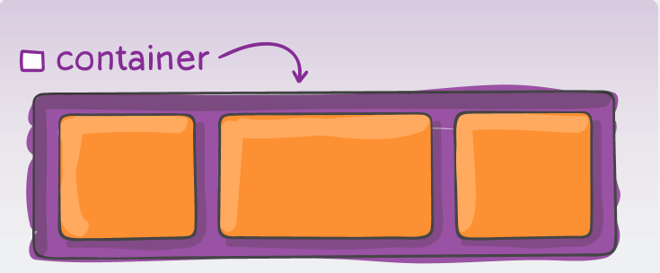
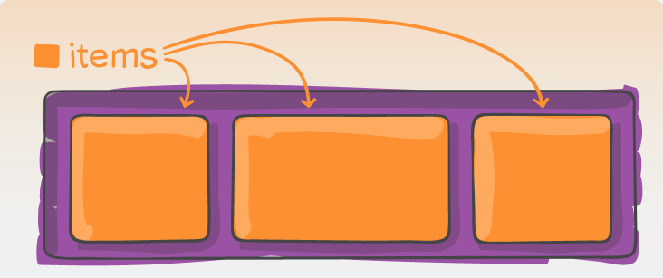

Flex es un modelo **unidimensional de layout** ya sea como **fila o como columna**, un método que ayuda a distribuir los elementos de una interfaz y mejorar las capacidades de alineación.

## Contenedor y elementos hijos

El **contenedor flex** y los **elementos hijos** son los componentes principales de flexbox. El contenedor flex es el elemento que contiene a los elementos hijos. Los elementos hijos son los elementos que se encuentran dentro del contenedor flex.

