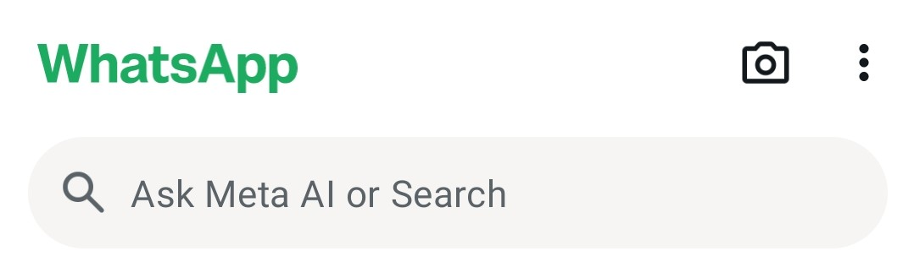
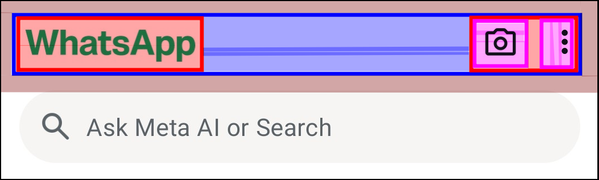
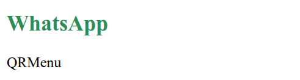

## Caso de estudio
Realizar el HTML y CSS del menu de WhatsApp

### Estructura de archivos y carpetas

- Crear una carpeta `flexbox-css`
- Ingresar a la carpeta `flexbox-css`
- Crear los archivos `index.html`, `app.css`
- Abrir el editor de codigo **Visual Studio Code** en la carpeta actual

### Estructura basica de un documento HTML

```html title="index.html" showLineNumbers
<html lang="es">
  <head>
    <meta charset="UTF-8" />
    <link rel="stylesheet" href="app.css" />
    <title>Flexbox CSS</title>
  </head>
  <body>
        
  </body>
</html>
```

### Vista de aplicacion


### Vista UX/UI


### Codigo HTML de la vista de la aplicacion

Agregar dentro de la etiqueta `body` las siguientes lineas

```html title="index.html" showLineNumbers
<nav>
  <ul id="nav-container">
    <li class="nav-item">
      <h2>WhatsApp</h2>
    </li>
    <li class="nav-item">
      <span>QR</span>
      <span>Menu</span>
    </li>
  </ul>
</nav>
```
## Propiedades por defecto de flexbox

Cualquier elemento HTML con la propiedad **display: flex** tiene las siguientes propiedades por defecto

```css title="app.css" showLineNumbers {3-5}
.nav-item {
  display: flex;
  flex-direction: row;
  flex-basis: auto;
  flex-wrap: nowrap;
}

ul {
  list-style-type: none;
  padding: 0;
  margin: 0;
}

h2 {
  color: seagreen;
}
```

### Resultado correcto 😎

