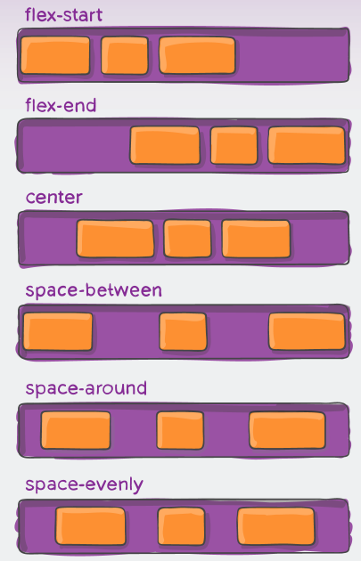
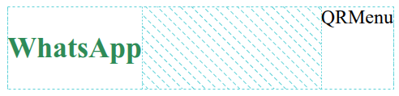
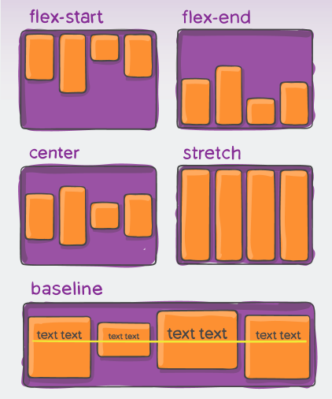
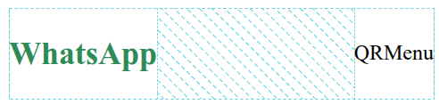
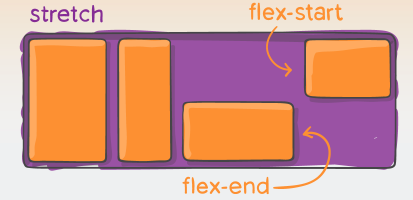
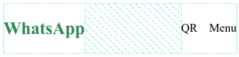
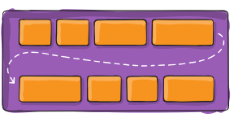

```css title="app.css"
#nav-container {
    display: flex;
}
```
### Resultado correcto 😎


## Alineacion horizontal justify-content



```css title="app.css"
#nav-container {
    justify-content: space-between;
}
```

### Resultado correcto 😎


## Alineacion vertical align-items



```css title="app.css"
#nav-container {
    align-items: center;
}
```

### Resultado correcto 😎


## Alineacion de item align-self



```css title="app.css"
.items {
    align-self: start;
}
```

## gap, row-gap y column-gap

Espacio entre elementos de fila y columna

### gap

Notacion resumida, esta propiedad permite establecer el espacio entre elementos de fila y columnas, el **primer** valor es para la **fila**, el **segundo** valor es para la **columna**

```css title="app.css" showLineNumbers
#container {
    display: flex;
    gap: 15px 20px;
}
```

### row-gap y column-gap

```css title="app.css" showLineNumbers
#container {
  display: flex;
  row-gap: 15px;
  column-gap: 20px;
}
```

Agregar en la class `nav-item` la siguiente linea

```css title="app.css"
.nav-item {
  column-gap: 16px;
}
```

### Resultado correcto 😎



## Flex wrap


```css title="app.css"
.container-one {
    flex-wrap: wrap;
}

.container-two {
    flex-wrap: nowrap;
}
```
