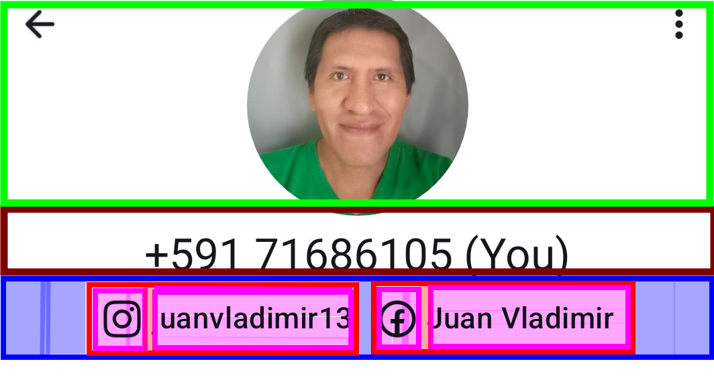
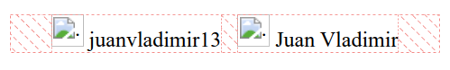
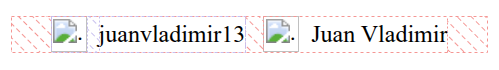
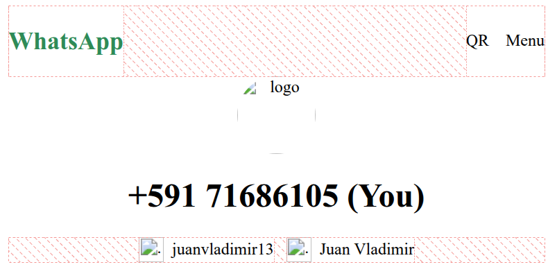

## Contacto de WhatsApp

### Vista de aplicacion


### Vista UX/UI


### Codigo HTML de la vista de la aplicacion

Agregar las siguientes lineas debajo de la etiqueta `nav`:

```html title="index.html" showLineNumbers
<header>
  <div id="avatar">
    
  </div>

  <h1>+591 71686105 (You)</h1>

  <div id="container">
    <section class="item-container">
      
      <span class="item-text">juanvladimir13</span>
    </section>
    <section class="item-container">
      
      <span class="item-text">Juan Vladimir</span>
    </section>
  </div>
</header>
```

```css title="app.css" showLineNumbers
#container {
  display: flex;
  justify-content: center;
  column-gap: 12px;
}

.item-icon {
  width: 24px;
  height: 24px;
}
```
### Resultado correcto 😎


Alinear iconos con texto

```css title="app.css" showLineNumbers
.item-container {
  display: flex;
  align-items: center;
  column-gap: 8px;
}
```
### Resultado correcto 😎


Estilos adiccionales

```css title="app.css" showLineNumbers
#avatar {
  text-align: center;
}

#avatar > img {
  width: 75px;
  height: 75px;
  border-radius: 50%;
}

h1 {
  text-align: center;
}
```

### Resultado correcto 😎

