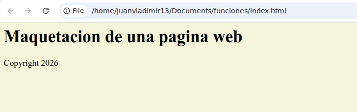
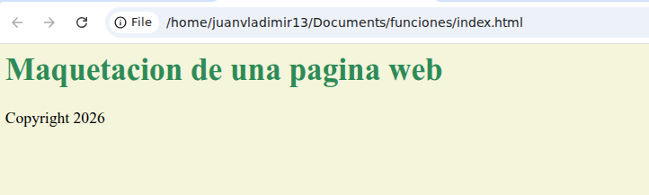
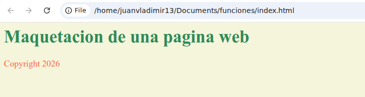
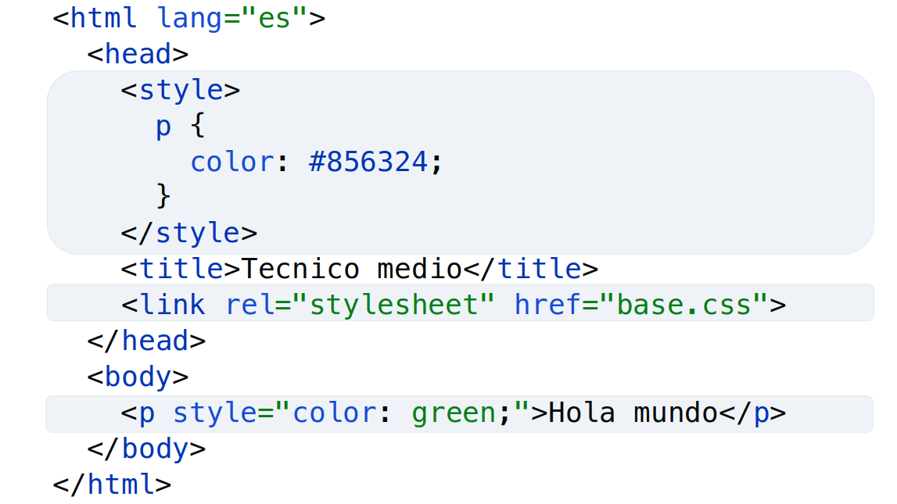

import Keycap from "../../../../../components/Keycap.astro";

Hay 3 formas de incluir CSS a HTML:

1. Etiqueta `<style>` dentro de la etiqueta **`<head></head>`**
2. Etiqueta `<link>` dentro de la etiqueta **`<head></head>`**
3. Atributo `style` en la **etiqueta HTML**

## Etiqueta `<style>`
Agregar como contenido de la etiqueta **`<head></head>`** la etiqueta **`<style></style>`**

```html title="index.html" showLineNumbers {3-7}
<html lang="es">
  <head>
    <style>
      body {
        background-color: beige;
      }
    </style>
  </head>

  <body>
  </body>
</html>
```

### Verficar avance
Abrir/recargar el archivo `index.html` en **google chrome**

#### Resultado correcto 😎


## Etiqueta `<link>`
Agregar como contenido de la etiqueta **`<head></head>`** la etiqueta **`<link/>`**, la etiqueta `<link/>` permite **enlazar** un archivo CSS **local o externo**

```html title="index.html" showLineNumbers {3}
<html lang="es">
  <head>
    <link rel="stylesheet" href="app.css">
  </head>

  <body>
  </body>
</html>
```

```css title="app.css" showLineNumbers
h1 {
  color: seagreen;
}
```

### Verficar avance
Abrir/recargar el archivo `index.html` en **google chrome**

#### Resultado correcto 😎


#### Resultado incorrecto ☹️
1. Presionar la combinacion de teclas <Keycap text="ctrl" /> + <Keycap text="shiftName" /> + <Keycap text="i" />
2. Seleccionar el menu `Console`
3. Leer los mensajes de error y solucionar el **bug** o **typo**

## Atributo `style` en una etiqueta HTML

```html title="index.html" showLineNumbers "style=\"color: tomato;\""
<p style="color: tomato;">Copyright 2026</p>
```

### Verficar avance
Abrir/recargar el archivo `index.html` en **google chrome**

#### Resultado correcto 😎


## Resumen de formas de incluir CSS a HTML

