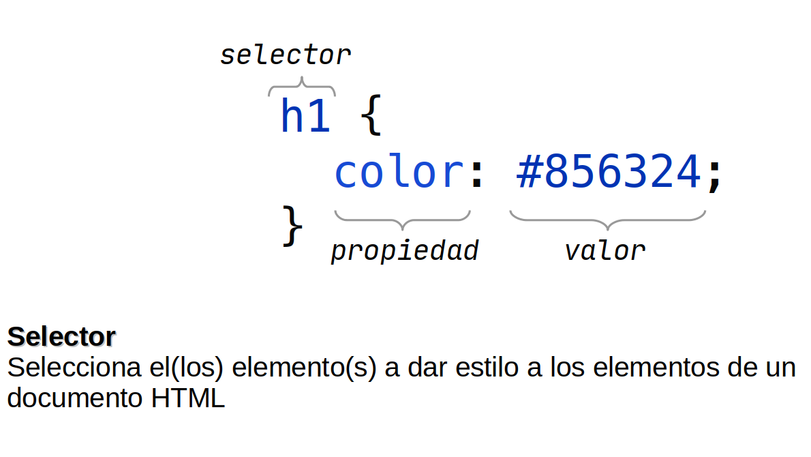
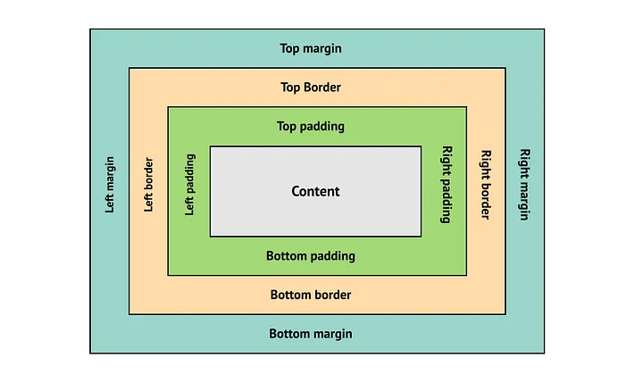

## Sintaxis de una regla CSS



## Todo es una caja

Cada elemento de HTML es una caja que tiene las siguientes propiedades:

- **background-color**: Color de fondo del contenido y del padding
- **color**: Color del contenido del elemento
- **margin**: Espacio fuera del elemento que lo separa de los demás
- **padding**: Espacio alrededor del contenido
- **border**: Línea que se encuentra fuera del padding
- **width**: Ancho del elemento
- **height**: Alto del elemento
- **display**: Modo de visualización para el elemento



### Ejemplo
```css title="app.css" showLineNumbers
h1 {
  color: seagreen;
  margin: 16px;
  padding: 8px;
  border: 4px solid green;
  height: 48px;
  width: 450px;
}
```

### Múltiples valores para una propiedad
Las propiedades **margin**, **padding** y **border-radius** aceptan múltiplos valores, acepta _uno_, _dos_, _tres_ o _cuatro_ valores de los siguientes:

- **Un** único valor aplicará para todos los **cuatro lados**.
- **Dos** valores aplicarán: El primer valor para **arriba y abajo**, el segundo valor para **izquierda y derecha**.
- **Tres** valores aplicarán: El primer valor para **arriba**, el segundo para **izquierda y derecha**, el tercero para **abajo**.
- **Cuatro** valores aplicarán en **sentido de las manecillas del reloj** empezando desde arriba. (**arriba**, **derecha**, **abajo**, **izquierda**)

#### Ejemplo con cuatro valores
```css
h1 {
  margin: 16px 10px 8px 5px;
  padding: 8px 16px 4px 16px;
  border-radius: 32px 20px 40px 16px;
}
```

#### Ejemplo con múltiples valores detallado
```css
h1 {
  margin-top: 16px;
  margin-right: 10px;
  margin-top: 8px;
  margin-left: 5px;

  padding-top: 8px;
  padding-right: 16px;
  padding-bottom: 4px;
  padding-left: 16px;
  
  border-top-left-radius: 32px;
  border-top-right-radius: 20px;
  border-bottom-right-radius: 40px;
  border-bottom-left-radius: 16px;
}
```
