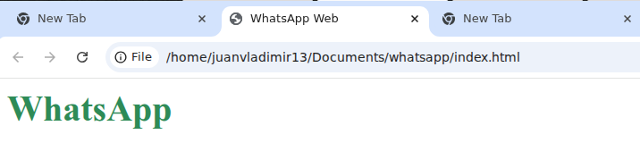
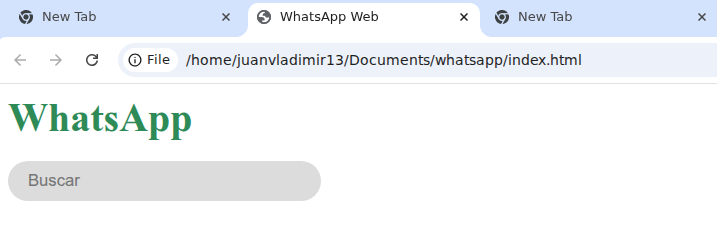
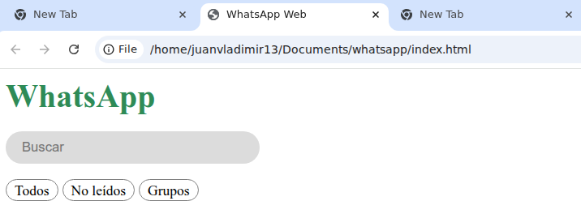

## Tipos de selectores CSS
1. Selector de `tipo/etiqueta`
2. Selector de `clase`
3. Selector de `id`
4. Selector de `atributo`
5. Selector de `atributo valor`

## Caso de estudio

#### Maquetacion de WhatsApp

1. Crear una nueva carpeta con el nombre de **whatsapp**
2. Dentro de la carpeta crear los archivos **index.html** y **app.css**
3. En **index.html** crear la estructura base del documento
4. En **app.css** crear los estilos base del documento

### Estructura del proyecto
```bash
├── whatsapp/
│   ├── index.html
│   └── app.css
```

```bash
mkdir whatsapp
cd whatsapp
touch index.html app.css
code .
```

### Estructura base del documento

```html title="index.html" showLineNumbers
<html lang="es">
  <head>
    <meta charset="UTF-8">
    <link rel="stylesheet" href="app.css">
    <title>WhatsApp Web</title>
  </head>
  <body>
    <header></header>
    <main></main>
    <footer></footer>
  </body>
</html>
```

### Selector de tipo/etiqueta
Define estilos base y globales (por ejemplo, que todos los párrafos tengan la misma tipografía o que todos los enlaces sean de color azul).

- Agregar dentro de la etiqueta `header` el siguiente contenido
```html title="index.html" "h1"
<h1>WhatsApp</h1>
```

```css title="app.css" showLineNumbers "h1"
h1 {
  color: seagreen;
  margin-bottom: 16px;
}
```

#### Resultado correcto 😎


### Selector de id
**Selecciona al único elemento** que tenga el atributo `id="..."` con el valor especifico.

:::danger
En un documento HTML **solo puede existir un id con el mismo valor.**
:::

:::note
No se recomienda abusar de él para diseño porque es muy difícil de sobrescribir debido a su alta especificidad.
:::

- Agregar luego de la etiqueta `h1` el siguiente contenido
```html title="index.html" "id=\"search\""
<input type="search" id="search" placeholder="Buscar">
```

```css title="app.css" "#search" showLineNumbers
#search {
  width: 250px;
  padding: 8px 16px;

  border-radius: 25px;
  border: none;
  background-color: gainsboro;
}
```
- Agregar dentro la etiqueta `main` el siguiente contenido
```html title="index.html" "id=\"message-filters\""
<section id="message-filters">
</section>
```

```css title="app.css" "#message-filters" showLineNumbers
#message-filters {
  margin-top: 16px;
}
```

#### Resultado correcto 😎


### Selector de clase
Estilo reutilizable en **múltiples elementos**, sin importar qué etiqueta tengan (puedes ponérselo a un botón, a un texto o a una tarjeta).

- Agregar dentro la etiqueta `section` el siguiente contenido

```html title="index.html" showLineNumbers "class=\"message-item-filter\"
<span class="message-item-filter">Todos</span>
<span class="message-item-filter">No leídos</span>
<span class="message-item-filter">Grupos</span>
```

```css title="app.css" showLineNumbers ".message-item-filter"
.message-item-filter {
  font-size: 14px;
  border: 1px solid gray;
  padding: 2px 8px;
  border-radius: 16px;
}
```

#### Resultado correcto


### Selector de atributo

Da un estilo general a elementos que poseen una característica o estado especial en el HTML

```html title="index.html"
<p data-id="g41df">13</p>
```

```css title="app.css"
p[data-id] {
  color: cornflowerblue;
}
```

### Selector de atributo valor
Selecciona el elemento solo si tiene el **atributo y su valor** coincide exactamente letra por letra

```html title="index.html"
<input data-user="student" />
```

```css title="app.css"
input[data-user="student"] {
  color: darkorange;
}
```
